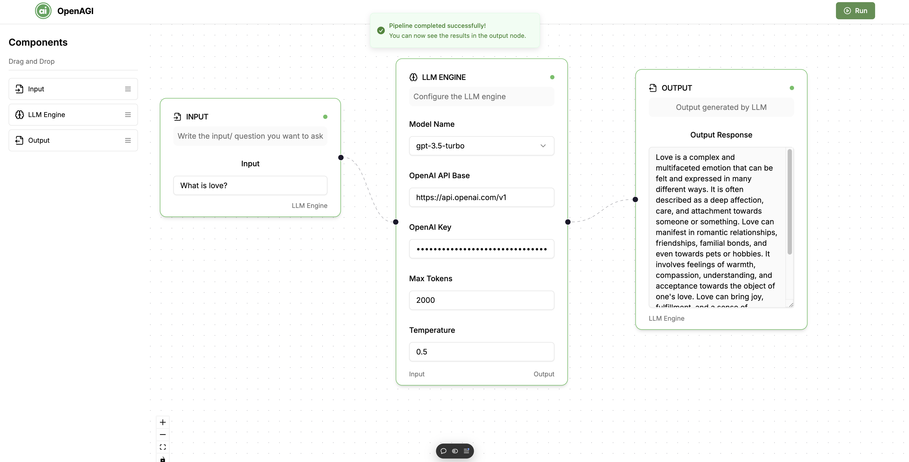

# 🤖 LLM Workflow Builder

A powerful visual workflow builder for Large Language Models, built with the T3 Stack.



## ✨ Features

- 🎨 **Visual Workflow Builder**: Drag-and-drop interface for creating LLM workflows
- 🧩 **Smart Node System**:
  - 📥 Input Node: Configure your prompts and queries
  - 🧠 LLM Node: Set up and customize your OpenAI model
  - 📤 Output Node: Display and format your results
- 🔗 **Intelligent Connections**: Smart connection validation between nodes
- ⚡ **Real-time Execution**: Run your workflows with a single click
- 🎯 **Error Handling**: Comprehensive error feedback and validation

## 🛠️ Tech Stack

This project is built on the [T3 Stack](https://create.t3.gg/), featuring:

- 🚀 [Next.js 14](https://nextjs.org) - React framework with App Router
- 🔐 [NextAuth.js](https://next-auth.js.org) - Authentication
- 💾 [Drizzle](https://orm.drizzle.team) - Type-safe ORM
- 🎨 [Tailwind CSS](https://tailwindcss.com) - Utility-first CSS
- 🔄 [tRPC](https://trpc.io) - End-to-end type-safe APIs
- ⚛️ [ReactFlow](https://reactflow.dev) - Flow-based node editor
- 🎭 [Shadcn/ui](https://ui.shadcn.com) - UI components

## 🚀 Getting Started

1. Clone the repository:

```bash
git clone
```

2. Install dependencies:

```bash
pnpm install
```

3. Run the development server:

```bash
pnpm dev
```
